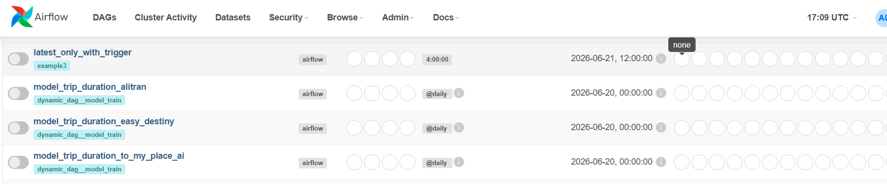
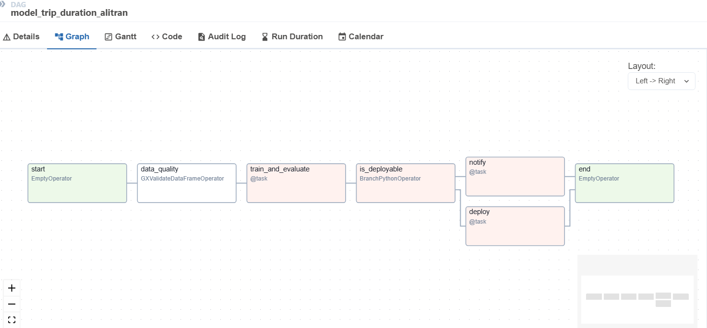

# Building an Advanced Data Pipeline With Data Quality Checks

An Apache Airflow pipeline that trains and deploys trip duration regression models per vendor, with automated data quality checks using Great Expectations before each training run.

---

## Overview

This project demonstrates a production-style ML pipeline pattern where:

- Data quality is validated before any training occurs
- A linear regression model is trained and evaluated per vendor
- Deployment is gated on model performance (RMSE threshold)
- DAGs are generated dynamically from a shared Jinja2 template and per-vendor config files

The pipeline runs locally using Apache Airflow with a Python virtual environment.

---

## Pipeline Architecture


```

## Prerequisites

- Python 3.12
- Apache Airflow 2.x
- The following Python packages:
  - `apache-airflow`
  - `apache-airflow-providers-great-expectations`
  - `great-expectations`
  - `pandas`
  - `numpy`
  - `scipy`
  - `pyarrow` or `fastparquet` (for parquet support)

---

## Local Setup

### 1. Create and activate the virtual environment

```bash
python -m venv airflow-env
# Windows
airflow-env\Scripts\activate
# macOS / Linux
source airflow-env/bin/activate
```

### 2. Install dependencies

```bash
pip install apache-airflow apache-airflow-providers-great-expectations great-expectations pandas numpy scipy pyarrow
```

### 3. Set the Airflow home directory

```bash
# Windows (cmd)
set AIRFLOW_HOME=%cd%\AIRFLOW_HOME

# Windows (PowerShell)
$env:AIRFLOW_HOME = "$PWD\AIRFLOW_HOME"

# macOS / Linux
export AIRFLOW_HOME=$(pwd)/AIRFLOW_HOME
```

### 4. Initialize the database

```bash
airflow db init
```

### 5. Create an admin user

```bash
airflow users create \
  --username admin \
  --password admin \
  --firstname Admin \
  --lastname User \
  --role Admin \
  --email admin@example.com
```

### 6. Start the Airflow webserver and scheduler

Run these in two separate terminals:

```bash
airflow webserver --port 8080
airflow scheduler
```

Then open [http://localhost:8080](http://localhost:8080) in your browser.

---

## Generating DAGs

DAGs are not hand-written — they are rendered from a shared template. To regenerate them after changing the template or configs:

```bash
cd src/templates
python generate_dags.py
```

This reads each `dag_configs/config_*.json` file, renders `template.py` with Jinja2, and writes the output to `src/dags/` (which should be synced to `AIRFLOW_HOME/dags/`).

### Adding a new vendor

1. Create `src/templates/dag_configs/config_<vendor_name>.json`:

```json
{
  "dag_name": "model_trip_duration_<vendor_name>",
  "vendor_name": "<vendor_name>"
}
```

2. Add the vendor's dataset under `data/datasets/<vendor_name>/train.parquet` and `test.parquet`.

3. Run `python generate_dags.py` to produce the new DAG file.

---

## Data Quality Check

Each DAG validates the training data before training using [Great Expectations](https://greatexpectations.io/). The check uses an ephemeral context (no persistent GX store) and validates:

- **Column**: `passenger_count`
- **Rule**: values must be between **1** and **6** (inclusive)

If validation fails, the DAG stops and does not proceed to training.

---

## DAG Schedule

All DAGs run on a `@daily` schedule with `catchup=False` and `start_date=2022-01-01`. Each task retries up to **2 times** on failure.
